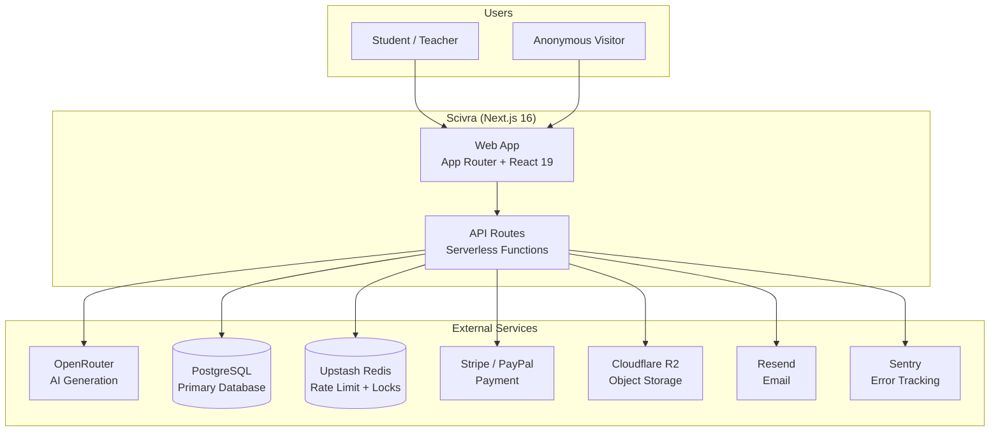
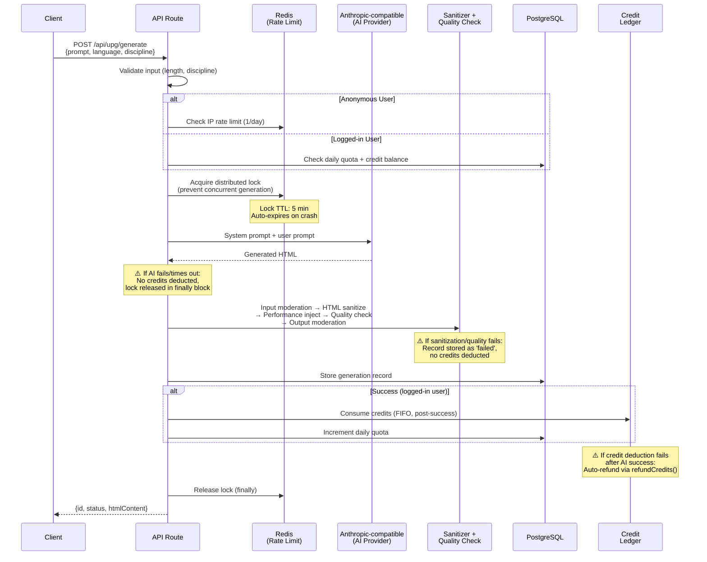
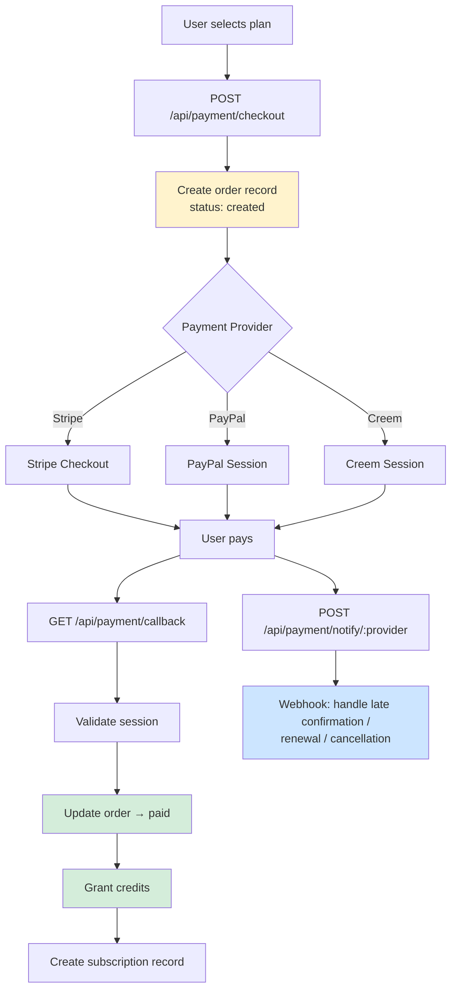
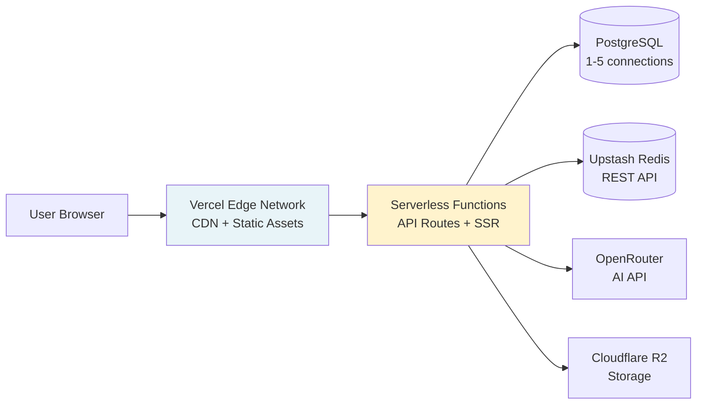

# Scivra v2 — Architecture Guide

> **Last verified:** 2026-04-13 | **Quarterly review:** update this date after verifying accuracy

This document is for **human developers**. For AI assistant instructions, see `CLAUDE.md`.
For coding standards and rules, see `.claude/rules/`.

## Table of Contents

1. [System Overview](#1-system-overview)
2. [Tech Stack](#2-tech-stack)
3. [Developer Guide](#3-developer-guide)
4. [Directory Structure](#4-directory-structure)
5. [Layered Architecture](#5-layered-architecture)
6. [Business Domains](#6-business-domains)
7. [Critical Flow: UPG Generation](#7-critical-flow-upg-generation)
8. [Authentication & Authorization](#8-authentication--authorization)
9. [Payment & Credit System](#9-payment--credit-system)
10. [Infrastructure & Deployment](#10-infrastructure--deployment)
11. [Documentation Index](#11-documentation-index)

## 1. System Overview

Scivra is an **AI-powered science education SaaS** targeting North American high school students and teachers. Two business lines:

- **Curated Labs** — Human-designed 3D interactive experiments (React Three Fiber), aligned to NGSS/AP Physics standards
- **UPG (Universal Principle Generator)** — AI generates standalone HTML interactive visualizations from any science prompt in 30-60 seconds

**Revenue:** Freemium subscriptions (Free / Pro $4.99/mo / Max $9.99/mo) + UPG credit consumption.



## 2. Tech Stack

| Layer | Technology | Version |
|-------|-----------|---------|
| Framework | Next.js (App Router, Turbopack) | 16.0.7 |
| Language | TypeScript (strict, zero `any`) | 5.x |
| UI | Tailwind CSS + shadcn/ui (new-york) | v4 |
| Theme | edu-academic (Academic Blue 250°, Merriweather serif) | — |
| Database | PostgreSQL + Drizzle ORM | 0.44.2 |
| Auth | Better Auth + RBAC | 1.3.7 |
| i18n | next-intl (en/zh, prefix: as-needed) | 4.3.4 |
| 3D | React Three Fiber + Drei (app) / standalone Three.js in generated UPG HTML | 9.5.0 |
| AI | Anthropic-compatible chat client with env/DB-configurable base URL | — |
| Cache | Upstash Redis (rate limiting + distributed locks) | REST |
| Payment | Stripe / PayPal / Creem | — |
| Storage | Cloudflare R2 | — |
| Email | Resend | 6.0.3 |
| Docs | Fumadocs (MDX) | 15.7.12 |
| Testing | Vitest (unit) + Playwright (e2e) | 4.0.18 / 1.58.2 |
| Deploy | Vercel (primary) / Cloudflare Workers (backup) | — |
| Package Manager | pnpm | — |

## 3. Developer Guide

### Environment Setup

```bash
# 1. Clone and install
git clone <repo-url> && cd scivra
pnpm install

# 2. Configure environment
cp .env.example .env.local
# Fill in: DATABASE_URL, AUTH_SECRET, UPSTASH_REDIS_REST_URL/TOKEN, ANTHROPIC_API_KEY or OPENROUTER_API_KEY

# 3. Setup database
pnpm db:push          # Apply schema to DB

# 4. Initialize RBAC (first time only)
pnpm rbac:init        # Create default roles and permissions

# 5. Start development
pnpm dev              # Turbopack dev server at localhost:3000
```

### Common Commands

| Command | Purpose |
|---------|---------|
| `pnpm dev` | Dev server (Turbopack) |
| `pnpm build` | Production build |
| `pnpm lint` | ESLint |
| `pnpm format` | Prettier format |
| `pnpm db:generate` | Generate Drizzle migrations |
| `pnpm db:push` | Apply schema to DB |
| `pnpm db:studio` | Drizzle Studio GUI |
| `pnpm test` | Vitest unit tests |
| `pnpm test:coverage` | Tests with coverage |
| `pnpm test:e2e` | Playwright E2E |
| `pnpm rbac:init` | Initialize roles/permissions |
| `pnpm rbac:assign` | Assign role to user |

### Common Operations

**Add a new page:**
1. Create route at `src/app/[locale]/(landing)/your-page/page.tsx`
2. Add i18n translations: `src/config/locale/messages/en/your-page.json` + `zh/`
3. Register namespace in locale config

**Add a new API route:**
1. Create `src/app/api/your-domain/route.ts`
2. Use `respData()` / `respErr()` from `@/shared/lib/resp`
3. Add Redis rate limiting for AI routes
4. Set `maxDuration` in `vercel.json` if needed (default: 30s, AI: 60s, UPG: 300s)

**Add a new database table:**
1. Define table in `src/config/db/schema.ts`
2. Create model file at `src/shared/models/your_table.ts`
3. Run `pnpm db:generate && pnpm db:push`

**Add a new business domain:**
1. `src/shared/blocks/your-domain/` — UI components
2. `src/shared/lib/your-domain/` — Domain logic (if needed)
3. `src/shared/models/your_model.ts` — Data access
4. `src/app/api/your-domain/route.ts` — API endpoints
5. `src/app/[locale]/(landing)/your-page/` — Pages

### Testing

- **Unit tests:** `tests/unit/` — Vitest, broad module coverage across routes, models, services, blocks, and UPG internals
- **E2E tests:** Playwright, screenshots saved to `test-screenshots/`
- **Must test:** UPG pipeline, credit consumption, rate limiting, API auth
- **Current practice:** unit tests use focused mocks heavily; integration tests cover route/service orchestration

## 4. Directory Structure

```
src/
├── app/              # Routes & pages (layout + data orchestration only)
│   ├── [locale]/     # i18n-wrapped pages (en default, zh at /zh/...)
│   │   ├── (landing)/   # Public pages + user features
│   │   ├── (admin)/     # Admin dashboard
│   │   ├── (auth)/      # Sign in/up
│   │   ├── (chat)/      # AI chat
│   │   ├── (docs)/      # Fumadocs documentation
│   │   └── (ai)/        # AI tools (UPG, image, music, video generators)
│   └── api/          # API route handlers
├── config/           # Configuration (schema, i18n messages, styles, env)
│   ├── db/schema.ts  # Central Drizzle schema definitions
│   ├── locale/       # en/zh translation JSON files
│   └── style/        # Tailwind + edu-academic theme CSS
├── core/             # Infrastructure (no business logic)
│   ├── auth/         # Better Auth configuration
│   ├── compliance/   # COPPA/GDPR services
│   ├── db/           # Database connection pool
│   ├── rbac/         # Role-based access control
│   ├── i18n/         # next-intl request config
│   └── theme/        # ThemeProvider
├── extensions/       # Pluggable third-party integrations
│   ├── payment/      # Stripe / PayPal / Creem
│   ├── analytics/    # GA / Plausible
│   ├── storage/      # Cloudflare R2
│   ├── email/        # Resend
│   └── monitoring/   # Sentry
├── shared/           # Business logic layer
│   ├── blocks/       # Business UI components organized by domain
│   ├── components/ui/# shadcn/ui atomic components
│   ├── contexts/     # React Context (AppContext, ChatContext)
│   ├── hooks/        # Custom hooks
│   ├── lib/          # Domain logic & utilities
│   ├── models/       # Data access layer
│   ├── services/     # Service layer (AI, payment, storage, email, RBAC)
│   └── types/        # TypeScript definitions
└── themes/           # Landing page theme components
```

### Dependency Direction (strict, one-way)

```
app → shared → config
app → core
app → extensions (primarily API routes and integration boundaries)
shared → config
shared/models → core/db
config ✗ shared (no back-references)
```

Violations will cause circular dependencies and break the build.

## 5. Layered Architecture

| Layer | Location | Responsibility | Can Import | Cannot Import |
|-------|----------|---------------|------------|---------------|
| **Routes** | `src/app/` | Page layout, data orchestration, API handlers | shared, core, extensions | — |
| **Core** | `src/core/` | Auth, compliance, RBAC, DB connection, i18n, theme | config | shared |
| **Models** | `src/shared/models/` | Database CRUD (one file per table) | config, core/db | extensions |
| **Services** | `src/shared/services/` | Business orchestration (AI, payment, storage) | models, lib, config | most core modules directly |
| **Lib** | `src/shared/lib/` | Domain logic, utilities (UPG pipeline, physics, etc.) | config, selected shared modules | unnecessary runtime coupling to app |
| **Blocks** | `src/shared/blocks/` | Business UI components, organized by domain | components/ui, hooks, lib | core, models |
| **UI** | `src/shared/components/ui/` | shadcn/ui atoms (Button, Card, Dialog, etc.) | nothing | everything above |
| **Extensions** | `src/extensions/` | Third-party integrations (pluggable) | config | shared, core |
| **Config** | `src/config/` | Schema, translations, styles, env vars | nothing | — |
| **Themes** | `src/themes/` | Landing page layout components | shared/blocks | core |

**Key rules:**
- UI components never import business logic
- Blocks are organized by domain; no cross-domain imports
- Extensions are pluggable: swap Stripe for another provider without touching business logic
- Server Components by default; `'use client'` only when interaction is needed

## 6. Business Domains

### Domain Map

| Domain | Directory | Core Models | Status | Description |
|--------|-----------|-------------|--------|-------------|
| **UPG** | `shared/lib/upg/`, `shared/blocks/upg/` | `upg_generation`, `upg_like`, `upg_report`, `upg_daily_quota`, `content_moderation` | Active | AI-generated interactive HTML visualizations |
| **Experiments** | `shared/blocks/experiments/`, `shared/lib/experiments/` | `experiment_progress` | Active | Curated 3D lab experiments with progress tracking |
| **Learning Paths** | `shared/blocks/learning-path/` | `learning_path`, `learning_path_node`, `learning_path_progress`, `learning_stats` | Active | Structured course sequences |
| **Gallery** | `shared/blocks/gallery/` | `upg_generation` (shared), `upg_like` | Active | Social discovery: like, fork, publish UPGs |
| **AP Prep** | `shared/blocks/ap-prep/` | `ap_exam`, `ap_unit`, `ap_question`, `ap_attempt`, `ap_user_progress` | Active | AP Physics exam practice system |
| **Quest** | `shared/blocks/quest/` | `quest`, `quest_step`, `quest_attempt`, `quest_step_response`, `achievement` | Active | Gamified physics challenges with scoring |
| **Lab Notebook** | `shared/blocks/notebook/` | `lab_notebook`, `lab_notebook_version`, `lab_notebook_export` | Active | Student experiment journals with AI assistance |
| **Chat** | `shared/blocks/chat/` | `chat`, `chat_message` | Active | AI conversation interface |

### UPG Domain Deep Dive

The UPG domain is the most complex. Key files:

| File | Purpose |
|------|---------|
| `shared/lib/upg/generate-core.ts` | Core pipeline: moderation → AI call → sanitize → quality check → validation → store. Shared by generate and fork endpoints. |
| `shared/lib/upg/system-prompt.ts` | 400+ line system prompt with modular components (Three.js directives, visual design, interaction, etc.) |
| `shared/lib/upg/html-sanitizer.ts` | XSS protection: iframe sandbox + CDN whitelist (only `cdn.jsdelivr.net`). Never weaken this. |
| `shared/lib/upg/quality-checker.ts` | Validates generated HTML: canvas/WebGL renderer, scene/camera creation, no infinite loops, responsive |
| `shared/lib/upg/anthropic-client.ts` | Primary Anthropic-compatible HTTP client used by generate/refine flows; can target Anthropic directly or a compatible gateway via base URL. |
| `shared/lib/upg/openrouter-client.ts` | Auxiliary OpenRouter client retained in the codebase for provider-specific use cases. |
| `shared/lib/upg/disciplines/` | Per-subject configuration (Physics, Chemistry, Biology, Earth Science, Math) |
| `shared/lib/upg/validation/` | Full validation pipeline and technical/physics validators |
| `shared/lib/moderation/` | Input/output content moderation (sensitive word lists, HTML pattern checks) |
| `shared/lib/performance/` | Injected into generated HTML: FPS counter, adaptive quality, mobile optimization |

### Domain Dependencies

```
Gallery ──depends on──▶ UPG (shares upg_generation table)
Quest ──references──▶ Experiments (quest steps can link to experiments)
Learning Paths ──references──▶ Experiments (nodes can be experiment-type)
Lab Notebook ──references──▶ Experiments (notebook entries per experiment)
```

All other domains are independent.

## 7. Critical Flow: UPG Generation

This is the most important and complex flow in the system. Endpoint: `POST /api/upg/generate`.



### Key Design Decisions

| Decision | Why |
|----------|-----|
| **Credits deducted AFTER AI success** | Keeps failed generations free. A compensating `refundCredits()` path still exists for post-generation persistence failures. |
| **Redis distributed lock** | Prevents a user from spamming generate. Serverless instances are isolated — in-memory locks don't work. Lock auto-expires (5min TTL) to prevent deadlocks on crashes. |
| **Separate provider client** (not Vercel AI SDK) | UPG needs synchronous full-HTML completions and provider-specific retry/error handling. |
| **HTML sanitization + iframe sandbox** | Generated HTML runs in user browsers. CDN whitelist (jsdelivr only) + banned patterns (eval, fetch, XMLHttpRequest) prevent XSS. |
| **Input + output moderation** | Input: sensitive word detection before AI call. Output: HTML pattern check after generation. Both non-blocking on "pending" — only block on "failed". |
| **Quality check is non-blocking on warnings** | Warnings are logged but don't reject the generation. Only hard failures (no canvas, no renderer) cause rejection. |

### Failure Modes

| Failure | Impact | Recovery |
|---------|--------|----------|
| AI provider timeout/error | Generation fails | No credits consumed, lock released, user can retry |
| HTML sanitization strips critical code | Quality check catches it | Stored as "failed", no credits consumed |
| Credit deduction fails after AI success | User gets result, credits not deducted | `refundCredits()` creates compensating GRANT transaction |
| Redis unavailable | Rate limit/lock skipped | Fail-open for rate limit; lock acquisition returns false (blocks generation) |
| Database insert fails | Generation lost | Error returned to user, no credits consumed |

## 8. Authentication & Authorization

### Auth Stack

- **Framework:** Better Auth 1.3.7 (`src/core/auth/`)
- **Methods:** Email/password + OAuth (Google, GitHub, optional Microsoft)
- **Session:** Token-based, stored in DB + cookie
- **User retrieval:** `getUserInfo()` returns current user or null (anonymous access supported)

On new user signup, `grantCreditsForNewUser()` automatically grants initial free credits (configurable via admin settings).

### RBAC

| Role | Capabilities |
|------|-------------|
| `admin` | Full access: user management, content moderation, settings |
| `editor` | Content management: posts, categories, learning paths |
| `user` | Default: generate UPG, use experiments, manage own content |
| (anonymous) | Limited: view gallery, 1 UPG generation/day, read-only experiments |

RBAC is defined in `src/core/rbac/`. Initialize with `pnpm rbac:init`, assign with `pnpm rbac:assign`.

### Compliance (COPPA / GDPR)

Located in `src/core/compliance/`. Key flows:

1. **Age gate** — Clients post age-group decisions to `/api/compliance/age-gate`; results are recorded in `consent_event` and `user_compliance_profile`.
2. **Consent management** — Cookie/privacy/terms events are tracked through `/api/compliance/consent`.
3. **Data rights** — Export, deletion, and status APIs live under `/api/privacy/*`, backed by `privacy_request` and `consent_event`.

## 9. Payment & Credit System

### Subscription Tiers

| Tier | Price | Daily UPG Limit | Credits/Month | Experiment Access |
|------|-------|----------------|---------------|-------------------|
| **Free** | $0 | 3 generations | — | 4 experiments lifetime |
| **Pro** | $4.99/mo | 10 generations | 30 credits | Full access |
| **Max** | $9.99/mo | Unlimited | 100 credits | Full access + priority |

### Rate Limiting

| User Type | Limit | Mechanism | Redis Key Pattern |
|-----------|-------|-----------|-------------------|
| Anonymous | 1 generation/day | IP hash + sliding window | `upg:anon:{ipHash}` |
| Free tier | 3 generations/day | DB daily quota table | `upg_daily_quota` |
| Pro tier | 10 generations/day | DB daily quota table | `upg_daily_quota` |
| Max tier | Unlimited | No limit | — |
| Concurrency | 1 at a time per user | Redis distributed lock | `upg:lock:{userId}` |

### Payment Flow



### Credit Ledger (FIFO)

Credits use a **ledger-based FIFO queue** (`src/shared/models/credit.ts`):

- **Grant:** Creates a `GRANT` transaction with `remainingCredits`. Sources: payment, subscription renewal, gift, refund.
- **Consume:** Fetches oldest active grant with `remainingCredits > 0`, deducts amount, creates `CONSUME` transaction. Uses `SELECT ... FOR UPDATE` to prevent race conditions.
- **Expiration:** Subscription credits expire at period end. One-time credits expire after `creditsValidDays`. `null` = never expires.
- **Refund:** Creates a new `GRANT` transaction (compensating entry). Used when post-generation DB operations fail.

**Failure handling:** If `consumeCredits()` fails after AI generation succeeds, `refundCredits()` creates a compensating GRANT transaction. The index `idx_credit_consume_fifo(userId, status, transactionType, remainingCredits, expiresAt)` ensures FIFO ordering is performant.

## 10. Infrastructure & Deployment

### Request Flow



### Environments

| Environment | URL | Deploy Trigger | Database |
|-------------|-----|----------------|----------|
| Local | `localhost:3000` | Manual (`pnpm dev`) | Local PostgreSQL |
| Preview | `*.vercel.app` | PR push (auto) | Preview DB |
| Production | Custom domain | Merge to `main` (auto) | Production DB |

### External Service Topology

| Service | Provider | Connection | Purpose |
|---------|----------|-----------|---------|
| PostgreSQL | Configurable | Direct TCP, pool 1-5 connections, singleton mode | Primary data store |
| Redis | Upstash | REST API (serverless-friendly) | Rate limiting, distributed locks |
| AI | OpenRouter | HTTPS | UPG generation, chat |
| Storage | Cloudflare R2 | AWS4 Fetch (S3-compatible) | HTML storage (V0.2), images |
| Email | Resend | HTTPS | Transactional emails |
| Monitoring | Sentry | HTTPS | Error tracking |
| Analytics | GA / Plausible / Vercel Analytics | Client-side | Usage analytics |

### Caching Strategy

| Layer | What | TTL | Invalidation |
|-------|------|-----|-------------|
| CDN / Edge | Static assets (`/imgs/*`) | 1 year, immutable | Redeploy |
| ISR | Landing pages, experiment lists | 1 hour (`revalidate: 3600`) | Redeploy or on-demand |
| Redis | Rate limit counters, locks | Seconds to minutes | Auto-expire (TTL) |
| DB Config | Global settings (`config` table) | Per-request (cached in models) | Admin update |
| None | UPG generation, auth state, credit balance | — | Always fresh |

### Observability

- **Error tracking:** Sentry (`src/extensions/monitoring/sentry`) — captures server exceptions in API routes
- **Key metrics to watch:**
  - UPG generation latency (p95 target: < 60s, max: 300s)
  - Credit consumption rate (anomaly = potential abuse)
  - Auth failure rate (anomaly = attack or config issue)
  - Daily active generations (capacity planning)
- **Logs:** Console output via Vercel Functions logs. Quality warnings logged for UPG generations.

### Vercel Function Configuration

Defined in `vercel.json`:

| Route Pattern | Max Duration | Reason |
|---------------|-------------|--------|
| `api/**` (default) | 30s | Standard CRUD |
| `api/upg/generate` | 300s (5 min) | AI generation can take 30-90s |
| `api/ai/**` | 60s | Chat streaming |
| `api/payment/**` | 30s | Payment callbacks |

**Cron job:** `/api/cron/data-retention` runs daily at 03:00 UTC for GDPR data cleanup.

### Docker (Backup Deployment)

Multi-stage build (`Dockerfile`): deps → builder → runner. Node 20 Alpine, non-root user, standalone output. Port 3000.

## 11. Documentation Index

| Category | File | When to Read |
|----------|------|-------------|
| **This document** | `ARCHITECTURE.md` | Day 1 onboarding, system overview |
| AI assistant guide | `CLAUDE.md` | If you're an AI agent working on this codebase |
| Coding standards | `.claude/rules/coding-standards.md` | Before writing code |
| Architecture constraints | `.claude/rules/architecture.md` | Before adding modules or changing dependencies |
| Safety red lines | `.claude/rules/safety.md` | Before touching auth, payment, compliance, or deployment |
| Testing rules | `.claude/rules/testing.md` | Before writing tests |
| Git workflow | `.claude/rules/git-workflow.md` | Before committing |
| Design documents | `docs/plans/` (24+ files) | Deep dive into specific features |
| Completion reports | `docs/reports/` (9+ files) | Understanding what was built and why |
| CTO review | `../UPG-CTO-REVIEW.md` | Understanding UPG architectural decisions |
| Competitive research | `../docs/research/phet-competitive-analysis.md` | Product positioning context |

### Document Responsibility

| Document | Audience | Updates When |
|----------|---------|-------------|
| `ARCHITECTURE.md` | Human developers | Architecture changes, new domains, infrastructure changes |
| `CLAUDE.md` | AI assistants | Project conventions change, new tools/patterns |
| `.claude/rules/*` | AI assistants + linters | Coding standards evolve |
| `docs/plans/*` | Team | New features designed |
| `docs/reports/*` | Team | Features completed |
